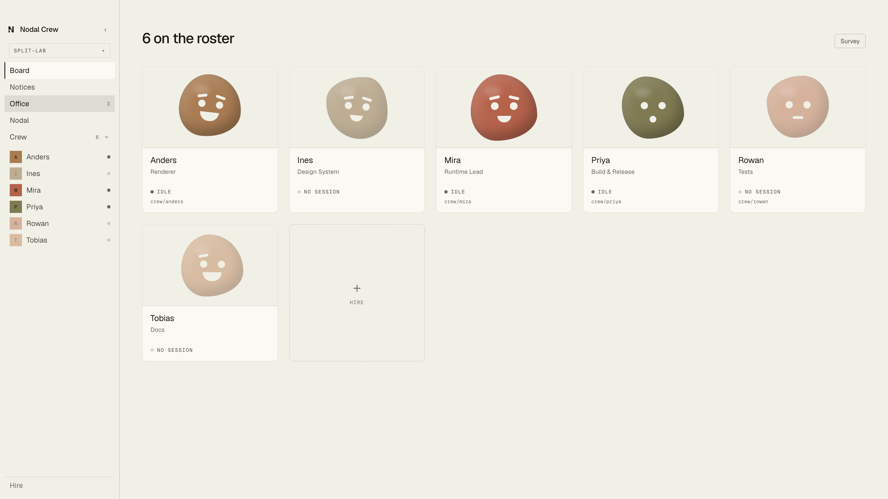
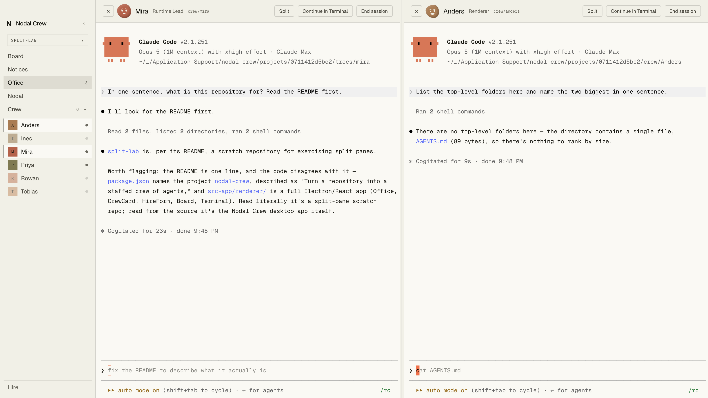
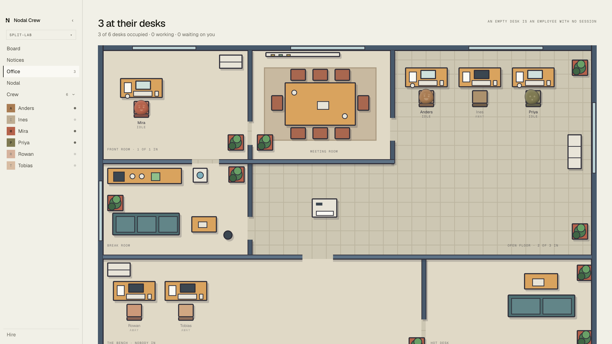
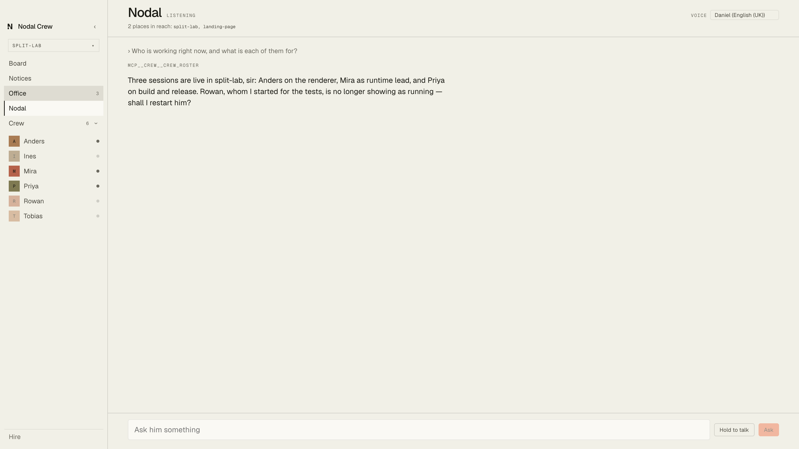

# Nodal Crew — releases

Disk images for [Nodal Crew](https://trynodal.dev/crew), and nothing else. The
source lives in a private repository; this one exists so that the download does
not need an account to reach.

**[Download the latest release →](https://github.com/Caissaisdead/nodal-crew-releases/releases/latest)**

---

Turn a repository into a staffed crew of agents. Nodal Crew reads a codebase,
proposes who it needs, and gives each of them their own checkout, their own
branch, and a bounded set of paths they own.



Every employee is a real Claude Code session in a real `git worktree` on
`crew/<name>`, so two of them can never be in one file. Up to four side by side.



The office map is the org made spatial — command in its own room, one desk per
package on the floor, the cross-cutting owners on a bench.



And Nodal himself, who has every connected repository in reach and can hire,
dismiss and start people on your behalf. ⌘⇧N summons him over anything.



---

## Download

The asset is named without a version, so this link keeps working:

```
https://github.com/Caissaisdead/nodal-crew-releases/releases/latest/download/Nodal-Crew-arm64.dmg
```

The version is in the release title and in the app's own Info.plist.

## What it needs

- Apple silicon. There is no Intel or universal build.
- macOS 11 or later.
- The Claude Code CLI on your PATH, signed in.

Every image here is signed with a Developer ID, notarised by Apple and stapled,
so it opens without a Gatekeeper warning. If one ever does not, that is a bug
worth reporting rather than a step to click through.

## Updating

There is no auto-update. A new version means downloading a new image.
